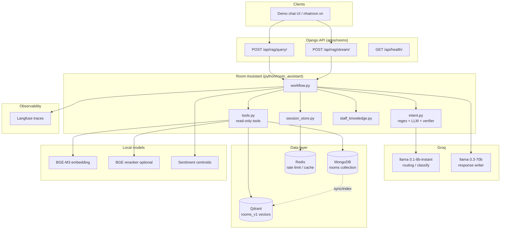
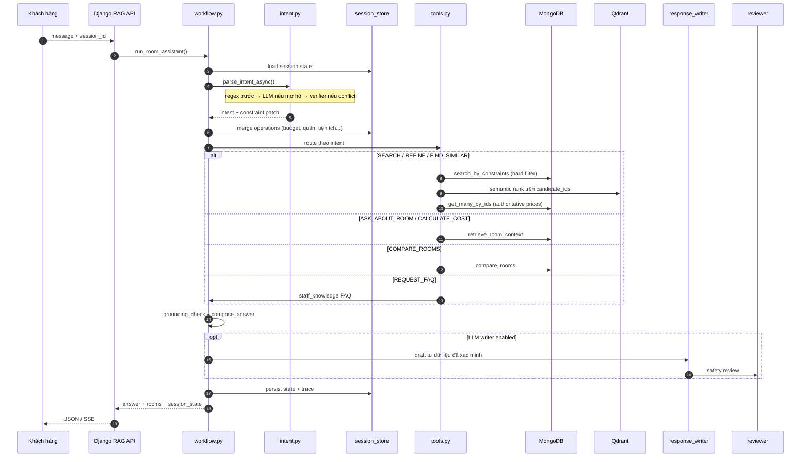
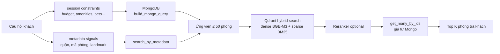
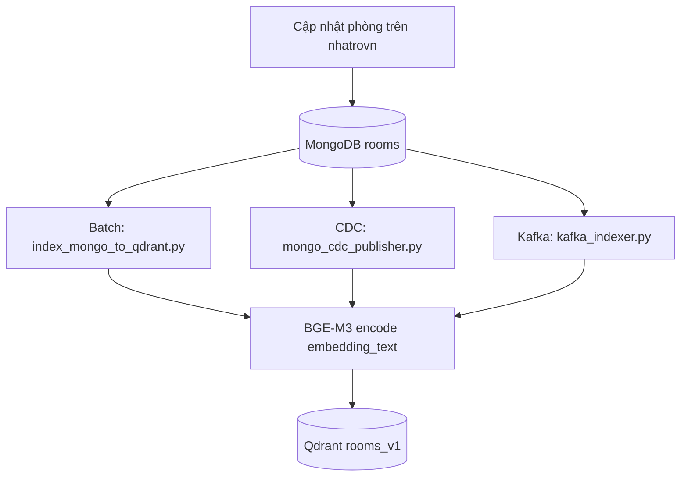

# Nhatrovn — Room Assistant RAG

Chatbot tư vấn phòng trọ cho [nhatrovn.vn](https://nhatrovn.vn): hiểu yêu cầu tiếng Việt, lọc phòng theo tiêu chí cứng từ MongoDB, xếp hạng ngữ nghĩa qua Qdrant, trả lời theo giọng nhân viên sales và có kiểm duyệt chống bịa dữ liệu.

Ví dụ hội thoại:

- *"Em lọc giúp chị vài căn quận 7 dưới 4 triệu, ưu tiên sạch sẽ nha"*
- *"Phòng #62963aae137e2a3d7e03c9d0 — cho em hỏi thêm chi tiết ạ"*
- *"So sánh giúp chị 2 căn đầu tiên để chị chọn nhanh"*

---

## 1. Kiến trúc tổng quan

Luồng production **không** đi qua LangGraph. Entry point thực tế là `python/room_assistant/workflow.py` (`run_room_assistant`), được Django API và `agents/graph.py` gọi trực tiếp.



### Vai trò từng thành phần

| Thành phần | Vai trò |
|---|---|
| **Django** | API REST/SSE, rate limit, CSRF cho UI nội bộ |
| **MongoDB** | Nguồn sự thật: giá, quận, trạng thái phòng, `embedding_text` |
| **Qdrant** | Hybrid dense + sparse search trên tập ứng viên đã lọc |
| **Regex intent** | Xử lý nhanh intent/slot rõ ràng (~85% lượt) |
| **Groq FAST** | LLM classify + router verifier khi regex không chắc |
| **Groq SMART** | Sinh câu trả lời sales (khi bật async writer) |
| **Reviewer** | Chặn hallucination, abstain khi thiếu grounding |
| **Langfuse** | Trace từng lượt: intent, retrieval, generation |

---

## 2. Luồng xử lý một lượt chat



### Intent hỗ trợ

| Intent | Mô tả |
|---|---|
| `SEARCH_ROOM` | Tìm/lọc phòng theo tiêu chí mới |
| `REFINE_SEARCH` | Điều chỉnh tiêu chí đang có trong session |
| `ASK_ABOUT_ROOM` | Hỏi chi tiết một phòng (giá, tiện ích, còn phòng…) |
| `COMPARE_ROOMS` | So sánh 2–3 phòng trong list kết quả |
| `CALCULATE_COST` | Ước tính chi phí thuê |
| `FIND_SIMILAR` | Tìm phòng tương tự |
| `REQUEST_FAQ` | Chính sách: cọc, pet, xem phòng, giảm giá… |
| `REQUEST_ACTION` | Đặt lịch / thanh toán / giữ phòng → từ chối lịch sự |
| `GENERAL_HELP` | Chào hỏi, off-topic, phản đối giá |

**Routing hai tầng** (`intent.py`):

1. **Regex/domain parser** — room id, quận, budget, ordinal phòng, keyword tiếng Việt.
2. **LLM classifier** (Groq FAST) — cứu trường hợp mơ hồ.
3. **Router verifier** — khi regex và LLM conflict ở tín hiệu cứng; fallback rule-based nếu LLM trả prose thay vì JSON.

Bot **read-only**: không tự đặt lịch, thu cọc, giữ phòng hay sửa tin đăng.

---

## 3. Hybrid retrieval

Nguyên tắc: **MongoDB lọc cứng trước, Qdrant xếp hạng sau**.



- Giá, quận, trạng thái còn phòng: **luôn** lấy từ Mongo sau khi rank.
- `semantic_index=None` khi gọi `run_room_assistant`: chỉ Mongo (dùng trong unit test).
- Không truyền `semantic_index`: tự kết nối Qdrant (`QDRANT_URL`).

---

## 4. Luồng indexing MongoDB → Qdrant



Script chính:

```bash
cd python
python scripts/index_mongo_to_qdrant.py
```

---

## 5. Cấu trúc mã nguồn

```text
nhatrovn/
├── apps/rooms/              # Django: RAG API, demo UI, Mongo helpers
├── config/                  # Django settings, urls
├── python/
│   ├── room_assistant/      # ★ Core: workflow, intent, tools, retrieval
│   ├── agents/              # LLM client, writer, reviewer, sentiment
│   ├── retrieval/           # Qdrant client, hybrid search, reranker
│   ├── kafka_workers/       # Optional realtime index consumers
│   ├── scripts/             # Index sync, CDC, chat backend test
│   └── tests/               # Unit + Mongo/Qdrant integration tests
├── docker-compose.qdrant.yml
├── RAG_API_CONTRACT.md      # Contract REST cho nhatrovn.vn
└── README_DEPLOY.md         # Hướng dẫn deploy production
```

### File quan trọng

| File | Chức năng |
|---|---|
| `python/room_assistant/workflow.py` | Orchestrator mỗi lượt chat |
| `python/room_assistant/intent.py` | Regex + LLM intent & constraint extraction |
| `python/room_assistant/repository.py` | Mongo adapter, `build_mongo_query` |
| `python/room_assistant/retrieval.py` | Repository-first hybrid search |
| `python/room_assistant/staff_knowledge.py` | Kịch bản FAQ / thương lượng giá |
| `python/agents/response_writer.py` | Sinh câu trả lời sales |
| `python/agents/reviewer.py` | Kiểm duyệt grounding / abstain |
| `python/retrieval/qdrant_client.py` | Qdrant hybrid wrapper |
| `apps/rooms/views.py` | `/api/rag/query`, `/api/rag/stream` |

---

## 6. Chạy local

### Yêu cầu

- Python 3.10+
- MongoDB (Atlas hoặc local) có collection `rooms`
- Qdrant (khuyến nghị cho search đầy đủ)
- Groq API key (cho LLM classify/writer)
- GPU tùy chọn (BGE-M3 embedding local)

### 1. Cấu hình môi trường

```bash
cp .env.example .env
# Điền MONGODB_URI, GROQ_API_KEY, QDRANT_URL, ...
```

### 2. Khởi động Qdrant

```bash
docker compose -f docker-compose.qdrant.yml up -d
```

Kiểm tra: `http://localhost:6333/collections` → collection `rooms_v1`.

### 3. Đồng bộ vector (lần đầu / sau khi Mongo đổi)

```bash
cd python
python scripts/index_mongo_to_qdrant.py
```

### 4. Chạy Django demo

```powershell
.\scripts\run_local_demo.ps1
# hoặc: python manage.py runserver 127.0.0.1:8000 --insecure
```

### 5. Chạy test

**Unit & regression (không cần MongoDB):**

```bash
cd python
python -m pytest tests/ -q
```

**Django API + chat persistence:**

```bash
python manage.py test apps.rooms.tests
```

**Replay từng cặp Q&A (transcript production + kịch bản bổ sung):**

```bash
# In-memory fixture Q7 (nhanh, CI-friendly)
python scripts/run_qa_audit.py --mode local

# Stack thật qua agents.graph + MongoDB
python scripts/run_qa_audit.py --mode live
```

**Kiểm tra data MongoDB trước demo:**

```bash
python scripts/pre_demo_mongo_audit.py
```

#### Cấu trúc test

| File | Mục đích |
|---|---|
| `python/tests/test_room_assistant_core.py` | Workflow, intent, retrieval, session |
| `python/tests/test_intent_parser.py` | Parse constraint / landmark / quận |
| `python/tests/test_landmark_aliases.py` | Chuẩn hóa TDTU, TTTM, đường, trường… |
| `python/tests/test_transcript_qa_regression.py` | Multi-turn Q&A transcript (in-memory) |
| `python/tests/test_mongo_behavior_scenarios.py` | Integration MongoDB + Qdrant (skip nếu thiếu URI) |
| `python/tests/test_production_integration.py` | Abstain / rerank guardrails |
| `python/tests/test_sources.py` | Source attribution |
| `apps/rooms/tests.py` | REST chat, RAG API, rate limit, persistence |
| `scripts/run_qa_audit.py` | Audit từng lượt Q&A + báo cáo JSON |
| `python/scripts/mine_landmark_phrases.py` | Dev: quét alias địa danh từ MongoDB |

**Đã loại khỏi runtime (legacy LangGraph):** `agents/router.py`, `grader.py`, `rewriter.py`, `extractor.py` — không còn import trong luồng chính.

Bộ `test_mongo_behavior_scenarios.py` chạy trên MongoDB thật, đối chiếu giá phòng và kiểm tra kịch bản sales (off-topic, đổi ý, thương lượng, hỏi chi tiết phòng).

---

## 7. API

| Endpoint | Mục đích |
|---|---|
| `POST /api/rag/query/` | REST đồng bộ cho backend nhatrovn.vn |
| `POST /api/rag/stream/` | SSE cho demo UI (same-origin + CSRF) |
| `GET /api/health/` | Health check |

Chi tiết request/response/error: [RAG_API_CONTRACT.md](./RAG_API_CONTRACT.md)

Deploy production: [README_DEPLOY.md](./README_DEPLOY.md)

---

## 8. Schema MongoDB `rooms` (runtime)

Collection production dùng bởi `MongoRoomRepository`:

```json
{
  "_id": "62963aae137e2a3d7e03c9d0",
  "room_id": "62963aae137e2a3d7e03c9d0",
  "house_id": "...",
  "embedding_text": "## Thông tin nhà\n- Địa chỉ: ...\n## Giá & phí\n...",
  "tien_ich_xq": "Gần TDTU, tiện đi học",
  "metadata": {
    "house_name": "YUHOME 3",
    "room_code": "203",
    "district_name": "Quận 7",
    "ward_name": "Phú Mỹ",
    "price": 2300000,
    "status_code": "0",
    "status_desc": "Phòng trống"
  }
}
```

`normalize_room()` trong `schemas.py` chuẩn hóa document này thành read model thống nhất cho tools và template trả lời.

---

## 9. Observability

Mỗi lượt chat tạo span Langfuse `room_assistant_turn`, bao gồm:

- `groq_chat_complete` — intent classify & router verifier
- Metadata intent, retrieval confidence, processing time

Cấu hình qua biến môi trường Langfuse trong `.env` (xem `.env.example`).

---

## 10. Nguyên tắc thiết kế

1. **Hybrid RAG, không vector-only** — filter cứng (giá, quận, còn phòng) trước semantic rank.
2. **Grounded answers** — giá và tiện ích lấy từ Mongo; reviewer abstain khi thiếu context.
3. **Sales tone có guardrail** — đồng cảm + CTA xem phòng, không hứa giảm giá / đặt cọc hộ.
4. **Regex-first routing** — giảm latency và chi phí LLM; LLM chỉ cứu edge case.
5. **Session-aware** — `REFINE_SEARCH` giữ ngữ cảnh budget/location qua nhiều lượt.

---

## Tài liệu liên quan

- [RAG_API_CONTRACT.md](./RAG_API_CONTRACT.md) — contract tích hợp
- [README_DEPLOY.md](./README_DEPLOY.md) — deploy & biến môi trường production
- [.env.example](./.env.example) — template cấu hình
